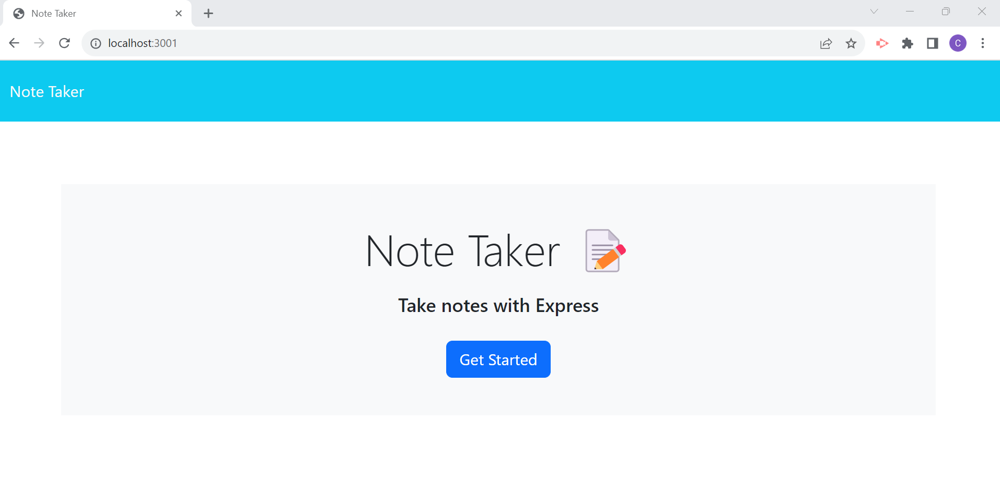
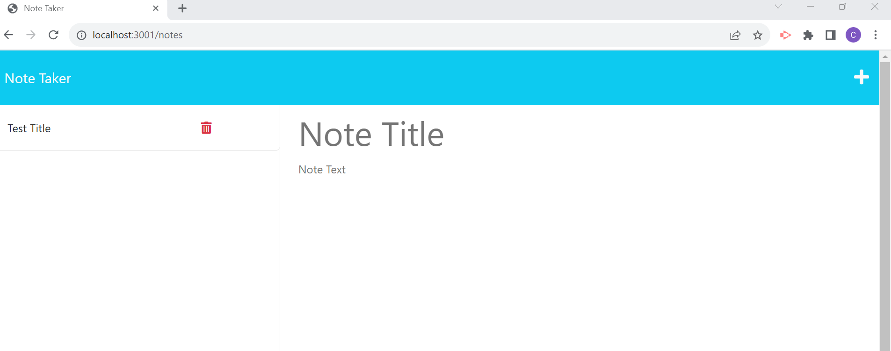

# Note Taker Challenge

## Description

Using starter code create a note taker application that meets the below criteria:

- Presented a landing page with a link to the notes page
- Existing notes listed in the left-hand column and an empty field on the right to input new notes
- Save icon appears when you enter in a new note
- Saved notes appear in the left-hand column
- Saves notes will appear in the right-hand column when selected
- When clicking the write icon, it navigates you to the top of the page and presented with a blank field

- Link to note taker application: [Note Taker](https://warm-woodland-99564-482d275ba83c.herokuapp.com/)

## Usage

To provide an application to take and save notes for a user

## Credits

N/A

## License

Please refer to the LICENSE in the repo.